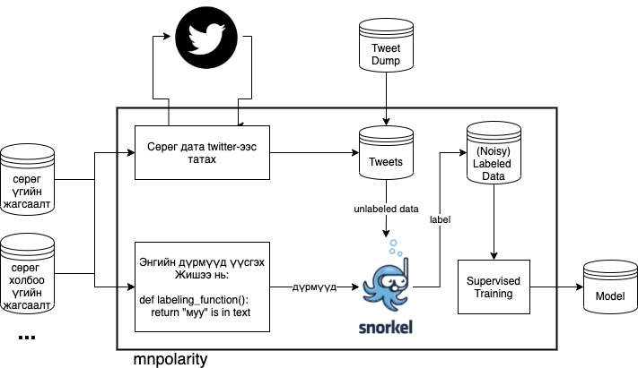

# MNPolarity - Mongolian Polarity Detection in Weakly Supervised manner

`#nolabel #tweet #classification #snorkel #weaklysupervised #dataprogramming #software2.0` 

Tweet polarization can be useful in many analysis as an extra factor. However, because of the lack of labeled data in Mongolian (low resource language), it is hard to make progress. So in this repo, we will try to improve our classification model using *data programming*.

*This project is highly dependant on snorkel.ai*



Contents:
- [Installation](#Installation)
- [Usage](#Usage)
- [Train Simplest Model](#Train-Simplest-Model)
- [Structure](#Structure)
- [How can you improve](#How-can-you-improve)
- [TODO](#TODO)
- [Reference](#Reference)

## Installation
```
git clone https://github.com/bayartsogt-ya/mnpolarity.git && cd mnpolarity
python3 -m venv env && source env/bin/activate
pip install -r requirements.txt
```

Download *latest* pre-trained models
```
wget https://github.com/bayartsogt-ya/mnpolarity/releases/latest/download/0.0.zip -P output/
unzip output/0.0.zip -d output && rm output/0.0.zip
```

## Usage
```python
>>> from mnpolarity.models import SimplestModel
>>> model = SimplestModel()
>>> model.load()
>>> prediction = model.predict("эд нарыг үзэн ядаж байна")  # https://twitter.com/tsbat_IT/status/937989630472761344
>>> prediction["prettier"]
`эд нарыг үзэн ядаж байна` => NEGATIVE (0.96)
>>> prediction
{
  'pred': 1, 
  'label': 'NEGATIVE', 
  'prob': 0.9598129979059339, 
  'prettier': '`эд нарыг үзэн ядаж байна` => NEGATIVE (0.96)'
}
```

## Train Simplest Model
```
python train_simplest.py
```

## Structure
```
.
├── ...
├── configs
├── data
│   ├── lf_helpers
│   │   └── negative
│   │       ├── emojis.txt
│   │       ├── phrases.txt
│   │       └── words.txt
│   └── train
│       ├── twint
│       │   ├── bad_word1.csv
│       │   ├── bad_word2.csv
│       │   └── ...
│       └── twitter_dump
│           ├── dump1.csv
│           ├── dump2.csv
│           └── ...
├── mnpolarity
│   ├── labeling_functions
│   │   ├── custom_lfs.py
│   │   └── ...
│   ├── models.py
│   └── ...
└── ...
```

## How can you improve
- Improve [Negative List](./data/lf_helpers/negative)
- Add more [custom labeling functions](./mnpolarity/labeling_functions/custom_lfs.py)
- Try&Feedback. If you have any request or idea to improve, [please email to me](mailto:bayartsogt.yadamsuren@gmail.com)

## TODO
- [ ] Negative list completion
- [ ] Positive list creation
- [ ] Negative list completion
- [ ] Labeling Function addition
    - The MOST IMPORTANT part of this code is [labeling functions build](src/labeling_functions/__init__.py)
- [ ] Experiment with hand labeled data
- [ ] Create (well validated) 1000-row test set 


## Reference
* Data Programming [read more](https://arxiv.org/abs/1605.07723)
* Software 2.0 [read more](https://karpathy.medium.com/software-2-0-a64152b37c35)

## Citation
```
@misc{mnpolarity,
  author = {Bayartsogt Yadamsuren},
  title = {Mongolian Polarity Detection in Weakly Supervised manner},
  year = {2021},
  publisher = {GitHub},
  journal = {GitHub repository},
  howpublished = {\url{https://github.com/bayartsogt-ya/mnpolarity/}}
}
```